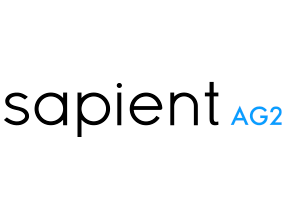

# 
 🔷 TESTE FRONT-END JÚNIOR 🔷

#### 
 _Um teste técnico realizado para a empresa Sapient AG2!_ 

 

***

## 🔷 RESUMO DO TESTE

Neste teste, foram desenvolvidos arquivos separados para avaliar as compreensões técnicas de desenvolvimento de software **Front-End**. Os conhecimentos técnicos esperados foram: **HTML5**, **CSS 3**, **Javascript** (_Vanilla_), e **versionamento** de código - _Git_. Além dos conhecimentos desejados, que foram conhecimentos básicos de **CLI (MacOS)** e boas práticas em sites **responsivos**.

***

## 🔷 COMO O TESTE FOI REALIZADO?

🔹 Clonando o projeto original

🔹 Sigando as instruções do README.md contido em cada uma das pastas

🔹 Criando o projeto em um respositório pessoal

🔹 Mudando o remote do repositório clonado para o meu repositório pessoal

🔹 Enviando o link do meu respositório pronto! 

***

## 🔷 1ª ETAPA: HTML

_O principal objetivo consiste na construção de um código semântico, e avaliação do nível de conhecimento nas tags do HTML e organização._

### Fases do desenvolvimento

🔹 Criação de um arquivo index.html na raiz da pasta _1-html_

🔹 Estruturação do HTML **sem CSS ou JS**

🔹 Inserção de todos os conteúdos dentro dos elementos criados

🔹 Inclusão das imagens de marcação fazendo referência a pasta _assets_ dentro desta mesma pasta

➡️ O código foi estruturado com base em um PDF, com o esqueleto da página, com textos de marcação aplicados e comportamentos de alguns elementos.

➡️ O arquivo final não tem nenhum estilo, é apenas um HTML corrido sem nenhuma formatação.

➡️ Possui todas as tags implementadas da melhor forma possível.

***

## 🔷 2ª ETAPA: CSS

_O principal objetivo consiste em avaliar o conhecimento em CSS e organização de código, além da replicação do layout responsivo para as versões desktop, tablet e mobile._

### Fases do desenvolvimento

🔹 Utilização do arquivo index.html na raiz da pasta _2-css_, que contém todas os elementos do _layout_.

🔹 Utilização do _layout do XD_ (site específico para o teste) para construir o CSS da página. 

🔹Replicação do _layout_ responsivo.
 
🔹Entrega apenas do arquivo de CSS.

➡️ O código foi estruturado com base nas tags criadas no HTML e no desenho realizado no _layout_.

➡️ O arquivo final não possui nenhuma semântica, uma vez que só a estilização foi aplicada.

➡️ Possui design responsivo implementado da melhor maneira possível.

***

## 🔷 3ª ETAPA: JavaScript

_O principal objetivo consiste em avaliar o conhecimento em JavaScript e organização de código, além da aplicação de funcionalidade, em áreas específicas que precisam de interação._

### Fases do desenvolvimento

🔹 Utilização do arquivo index.html na raiz da pasta _3-js_, que contém a estrutura da página, com um código não semântico, mas funcional.

🔹 Utilização do arquivo _main.css_ da pasta _3-js_, que já estava com o CSS formatado para a exibição da página e de todos os comportamentos que precisavam ser aplicados.

🔹 Criação das funções no arquivo _main.js_.

🔹 Utilização do HTML para encontrar comentários sobre as classes que ativam as áreas que precisam de interação e chamar as funções. 

### OBJETIVO DE CADA FUNÇÃO:

➡️ Abrir e fechar o menu com o clique no botão Menu.

➡️ Play do vídeo ao clicar na imagem de capa. 

➡️ Sistema de sanfona para a lista.

➡️ Carregamento de conteúdo ajax pela _API_ da _CatFact_.

➡️ Abrir modal com a foto e fazer função no botão de fechar.

***

##### 🔷 ESTE DESAFIO FOI DESENVOLVIDO POR: [VANESSA MENEZES](https://github.com/VanessaNMenezes) 💙

***
